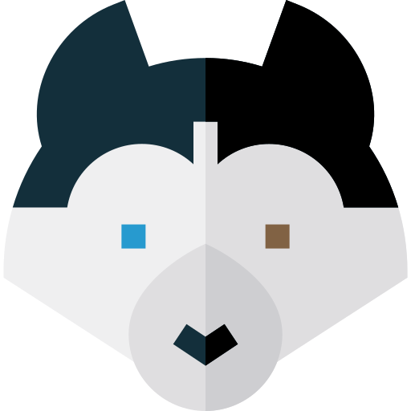

    

# Husky

Husky is a bag of classes, functions, and extensions complementary to [Kotlin's](https://kotlinlang.org/) standard library.

# Credits

Icon made by [Freepik](http://www.freepik.com) from [www.flaticon.com](https://www.flaticon.com) 
